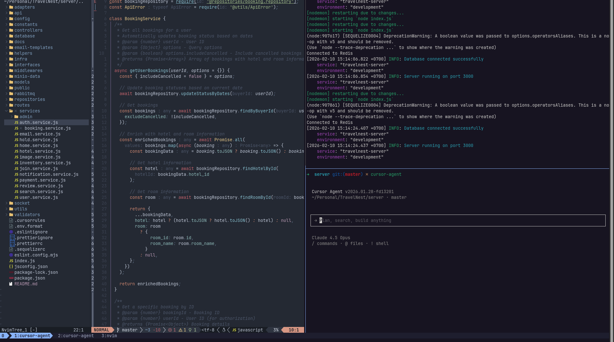
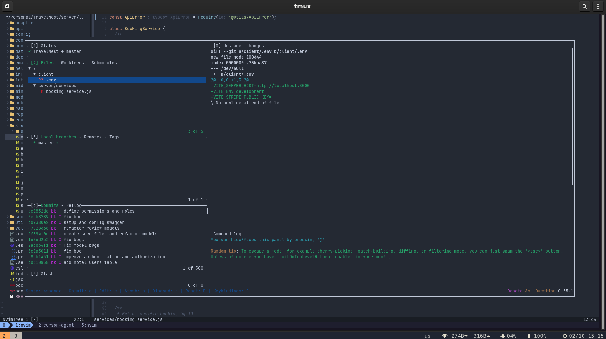

# Dotfiles

My personal development environment configuration for fullstack JavaScript/TypeScript development. This repository contains configurations for Neovim, tmux, and Zsh that I use daily.





## What's Included

- **Neovim** - Modern text editor with LSP, completion, and extensive plugin ecosystem
- **tmux** - Terminal multiplexer with vim-like navigation
- **Zsh** - Shell configuration with Oh My Zsh
- **Lazygit** - Lazygit integration for Git

## Neovim Configuration

### Features

- **Plugin Manager**: [lazy.nvim](https://github.com/folke/lazy.nvim) for fast, lazy-loaded plugins
- **LSP Support**: Full Language Server Protocol integration with TypeScript-specific enhancements
- **AI Completion**: Supermaven for AI-powered code suggestions
- **Fuzzy Finder**: Telescope for file navigation, grep, and more
- **File Explorer**: nvim-tree with tree view sidebar
- **Git Integration**: Git signs, blame, diff view, and conflict resolution
- **Syntax Highlighting**: Treesitter for accurate syntax parsing
- **Formatting & Linting**: Conform.nvim and nvim-lint for code quality
- **Terminal**: Integrated terminal with toggle keymaps
- **Session Management**: Persistence plugin to restore workspace state
- **HTTP Client**: Kulala for testing REST APIs directly in Neovim

### Key Plugins

| Category      | Plugin                                 |
| ------------- | -------------------------------------- |
| Theme         | Catppuccin-style colorscheme           |
| Statusline    | lualine.nvim                           |
| Completion    | nvim-cmp + Supermaven                  |
| LSP           | nvim-lspconfig + typescript-tools.nvim |
| Fuzzy Finder  | telescope.nvim                         |
| File Explorer | nvim-tree.lua                          |
| Git           | gitsigns.nvim, diffview                |
| Syntax        | nvim-treesitter                        |
| Formatting    | conform.nvim                           |
| Linting       | nvim-lint                              |

### Keybindings

Leader key: `Space`

| Keybind       | Action                                    |
| ------------- | ----------------------------------------- |
| `<leader>w`   | Save file                                 |
| `<leader>q`   | Quit                                      |
| `<leader>sv`  | Split vertically                          |
| `<leader>sh`  | Split horizontally                        |
| `H` / `L`     | Go to beginning/end of line               |
| `<C-h/j/k/l>` | Navigate between splits (works with tmux) |

## tmux Configuration

### Features

- Prefix key: `Ctrl+a`
- Mouse support enabled
- Vi-style copy mode
- Seamless navigation with Neovim via vim-tmux-navigator
- Catppuccin-style status bar matching Neovim theme
- Session persistence with tmux-resurrect and tmux-continuum

### Key Bindings

| Keybind            | Action                       |
| ------------------ | ---------------------------- |
| `Ctrl+a`           | Prefix                       |
| `prefix + \|`      | Split pane vertically        |
| `prefix + -`       | Split pane horizontally      |
| `prefix + h/j/k/l` | Navigate panes               |
| `Alt + h/l`        | Previous/Next window         |
| `Ctrl + h/j/k/l`   | Seamless vim/tmux navigation |

### Plugins

- tpm (Tmux Plugin Manager)
- tmux-sensible
- vim-tmux-navigator
- tmux-resurrect
- tmux-continuum

## Zsh Configuration

- Oh My Zsh framework
- Plugins: git, zsh-autosuggestions, zsh-syntax-highlighting
- NVM for Node.js version management
- pnpm package manager support

## Installation

### Prerequisites

- Neovim >= 0.9
- tmux >= 3.0
- Zsh
- Git
- Node.js (via nvm)
- ripgrep (for Telescope grep)
- A Nerd Font for icons

### Setup

1. Clone this repository:

```bash
git clone https://github.com/yourusername/dotfiles.git ~/dotfiles
```

2. Symlink configurations:

```bash
# Neovim
ln -s ~/dotfiles/nvim ~/.config/nvim

# tmux
ln -s ~/dotfiles/tmux/.tmux.conf ~/.tmux.conf

# Zsh (backup your existing .zshrc first)
cp ~/dotfiles/zshrc.txt ~/.zshrc
```

3. Install tmux plugins:

```bash
git clone https://github.com/tmux-plugins/tpm ~/.tmux/plugins/tpm
# Then press prefix + I inside tmux to install plugins
```

4. Open Neovim and let lazy.nvim install all plugins automatically.

## Directory Structure

```
dotfiles/
├── nvim/
│   ├── init.lua              # Entry point
│   ├── lua/
│   │   ├── core/
│   │   │   ├── keymaps.lua   # Custom keybindings
│   │   │   └── options.lua   # Vim options
│   │   └── plugins/          # Plugin configurations
│   └── snippets/             # Custom snippets (JS, TS, Vue)
├── tmux/
│   └── .tmux.conf            # tmux configuration
├── zshrc.txt                 # Zsh configuration
└── docs/                     # Screenshots
```

## License

MIT
